week 1

<details>
<summary>Day 1</summary>

### Simulation
Checking of design is done by simulation.  
We are going to use iverilog simulator to simulate the design.

### Design
Design is the actual verilog code or set of verilog codes which has the intended functionality to meet with the required specification.

### Test Bench
TB (Test Bench) is used to check whether it obeys required specifications or not.  
We have to apply stimulus (test_verilog) to the design and observe output to check whether it matches with specifications or not.

### How Simulation Works
First, simulator checks for the changes on the input. Upon change to the input, the output is evaluated. If no change to input, no change in output.

We have to instantiate Design in TB, then we have availability to apply stimulus (test_cases).  
Design may have 1 or more primary inputs & outputs.

### Iverilog Basic Flow

1. We give design and TB to iverilog simulator for checking specifications.
2. Iverilog simulator only checks changes in input; if there are changes in input, we dump the changes in output.
3. `.vcd` file (Value_Change_Dump format) is an output file which is used to check the changes in the output.
4. gtkwave is used to map the output changes in form of a wave.

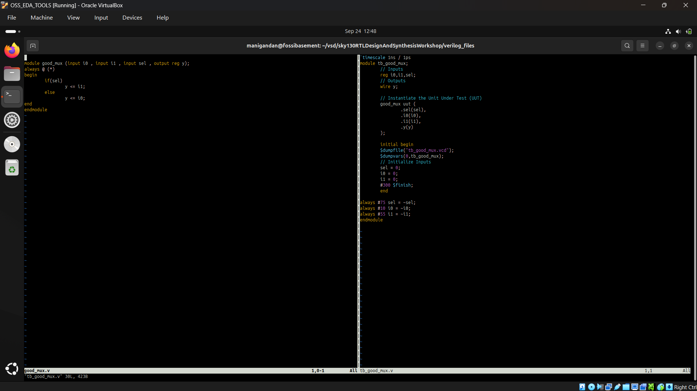
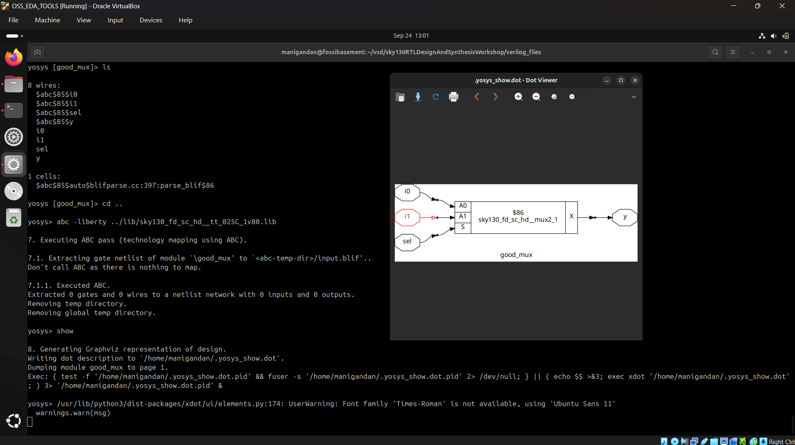
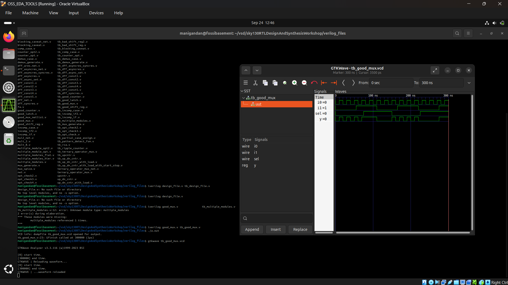

</details>

<details>
<summary>Day 2</summary>

The commands to run synthesis
```bash
read_liberty -lib ../lib/sky130_fd_sc_hd__tt_025C_1v80.lib
read_verilog module.v
synth -top module
dfflibmap -liberty ../lib/sky130_fd_sc_hd__tt_025C_1v80.lib
abc -liberty ../lib/sky130_fd_sc_hd__tt_025C_1v80.lib
show
```
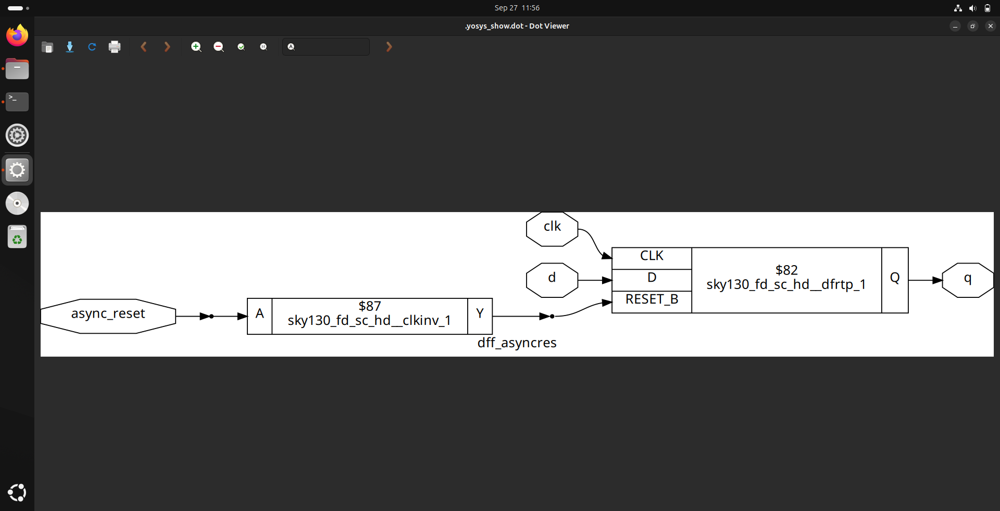
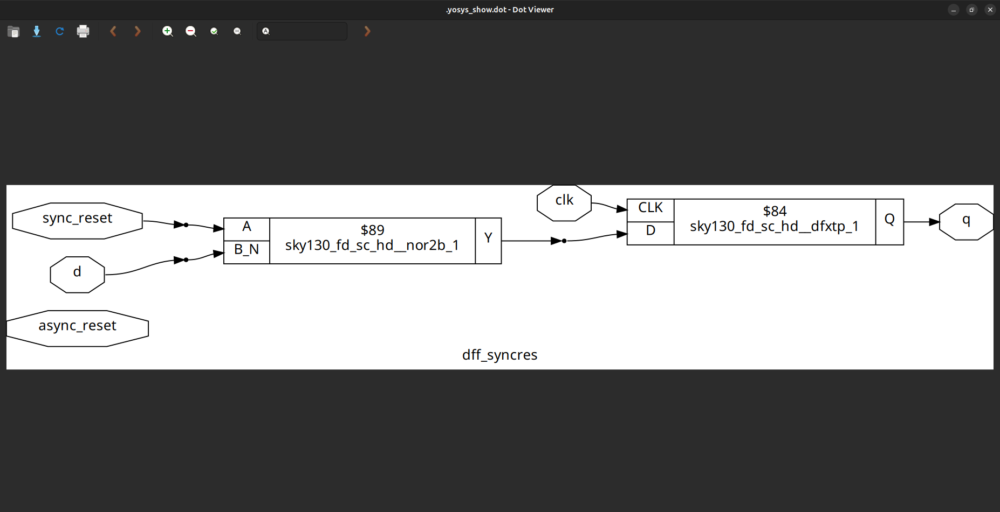
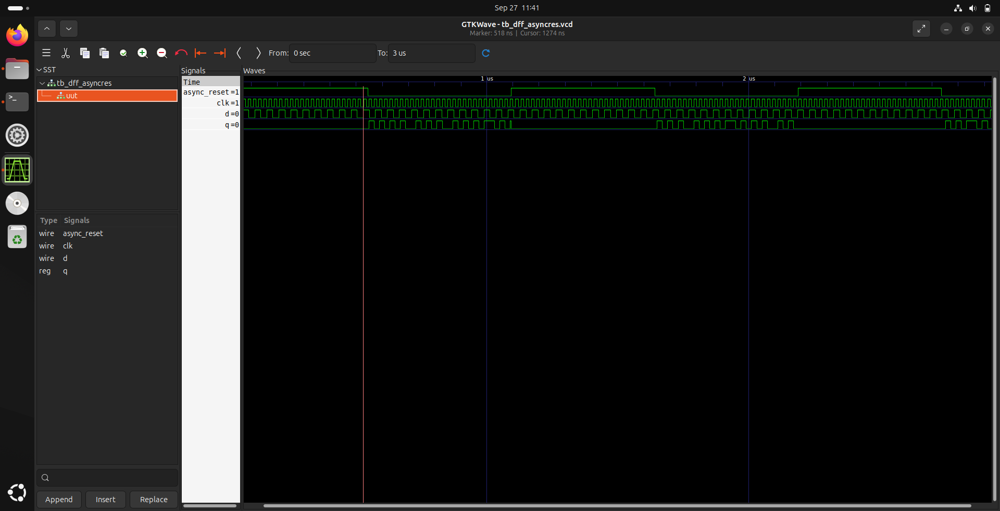
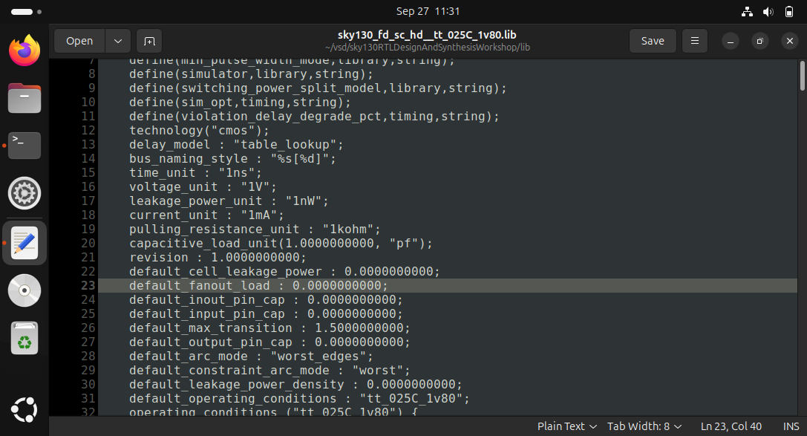
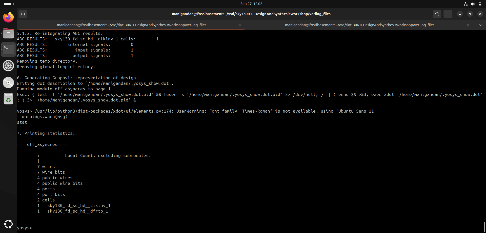
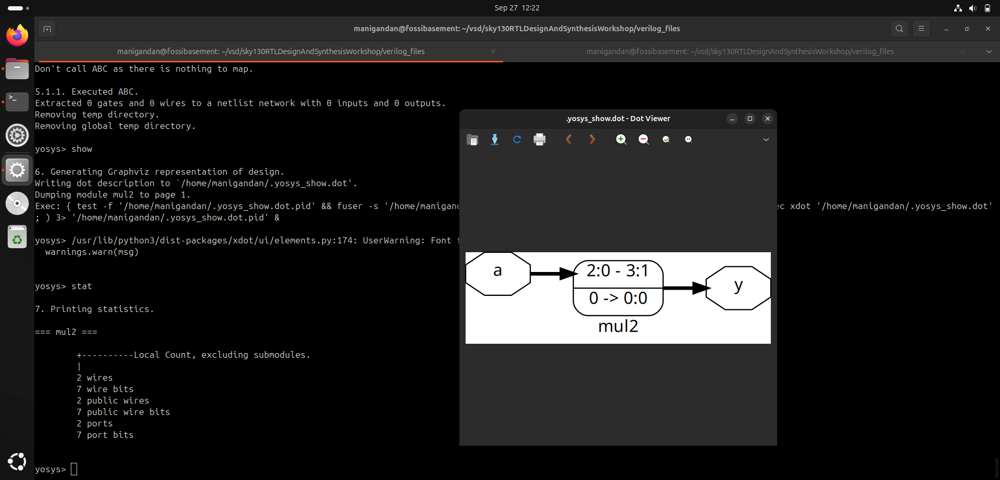
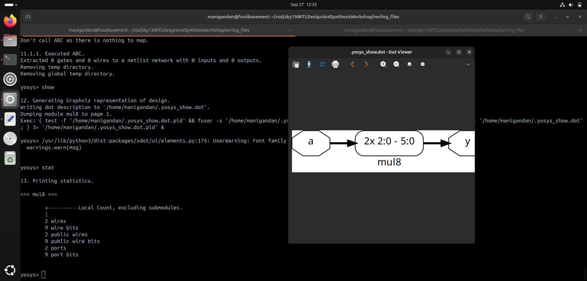

</details>

<details>
<summary>Day 3</summary>

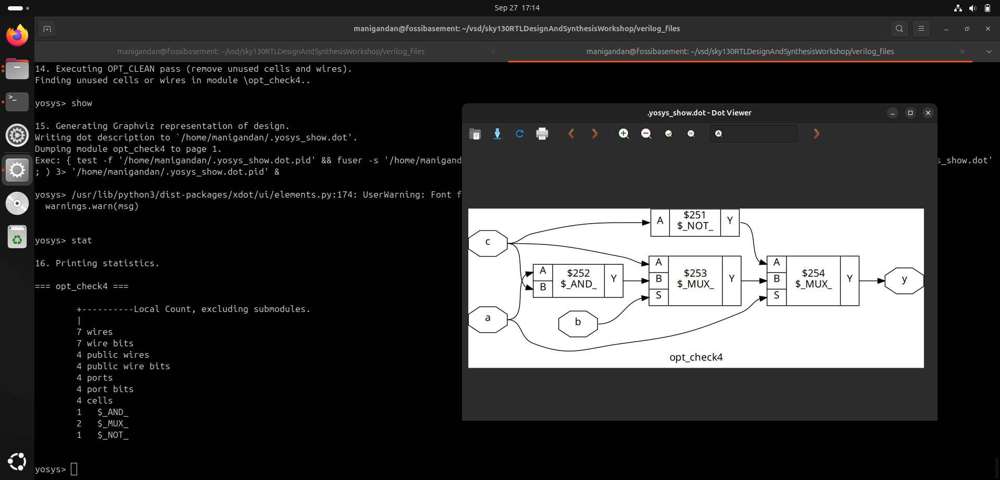
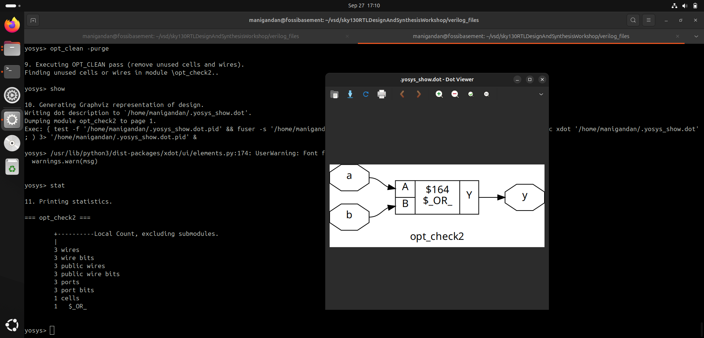
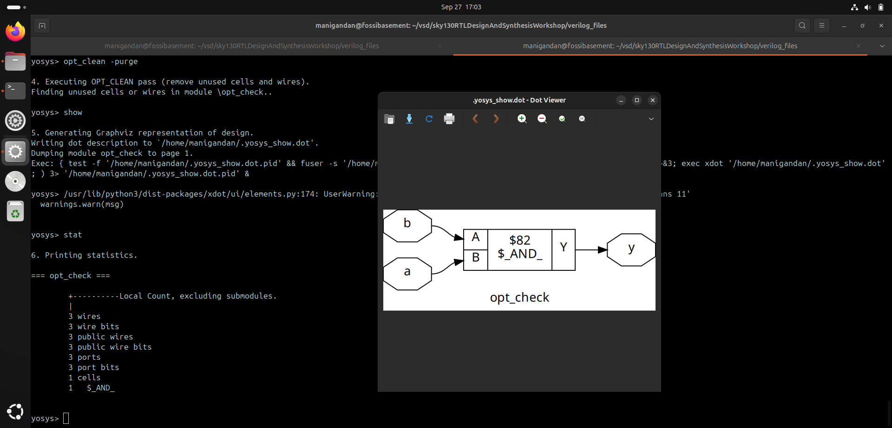


</details>


<details>
<summary>Day 4</summary>


</details>


<details>
<summary>Day 5</summary>


</details>
