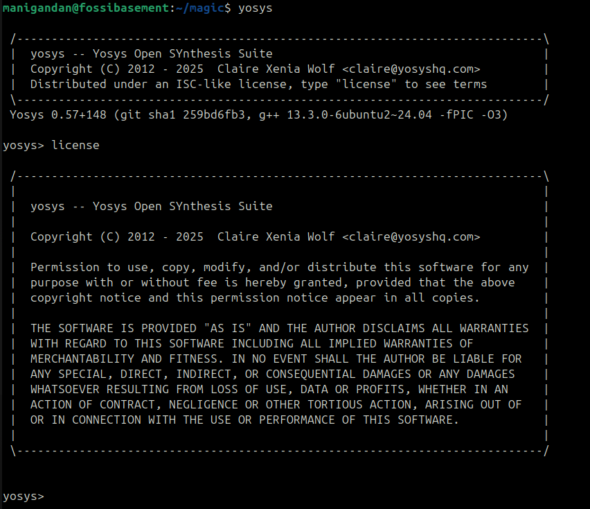
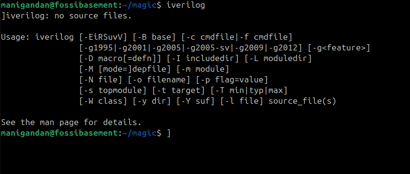
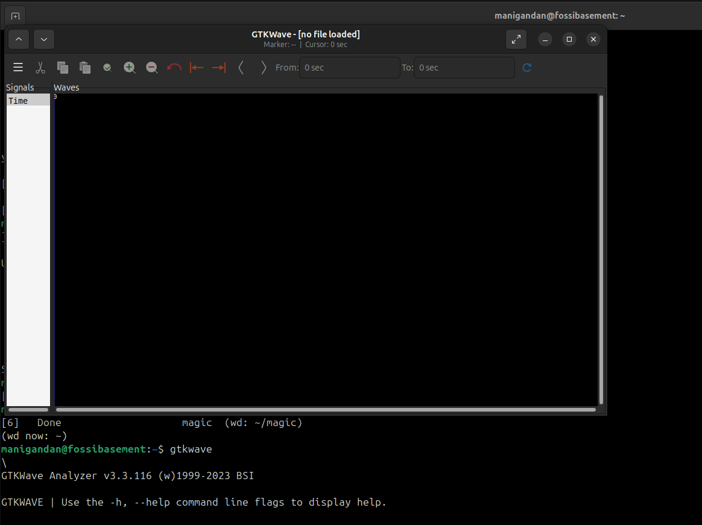
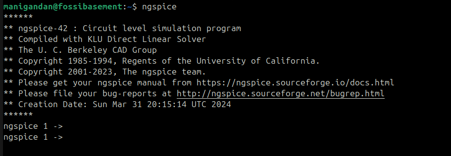
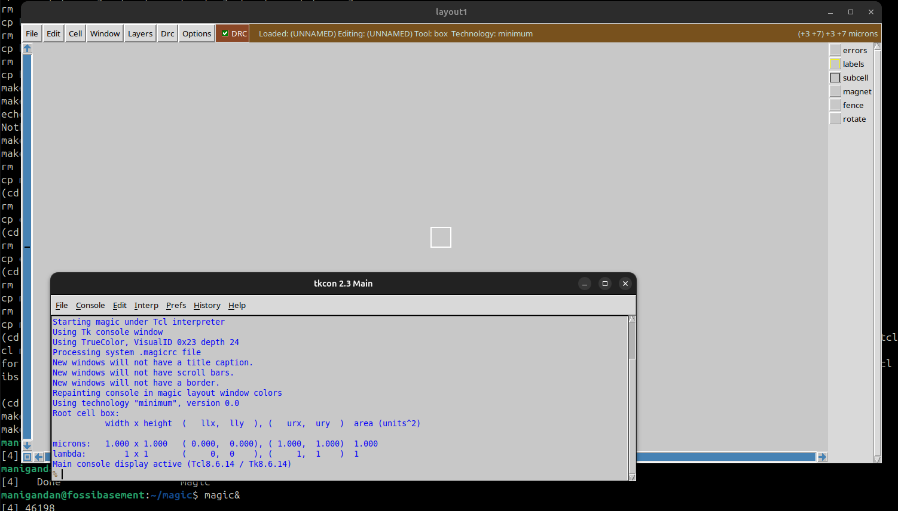
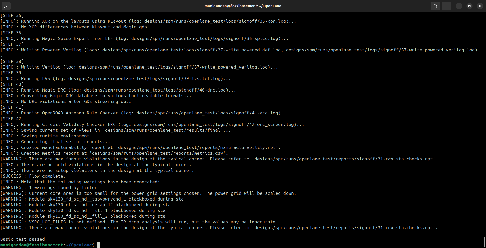

# Week 0 – Task 1 and 2

## Objective
- Create GitHub repo for documentation  
- Understand the complete SoC design flow from RTL to GDSII.
- Check system requirements  
- Install all required tools for the RISC-V SoC Tapeout flow.

/**
 * SoC Design Flow:
 * - The design methodology follows a structured approach with four main stages, each representing different abstraction levels from high-level modeling to physical implementation.
 *
 * Design Flow Architecture:
 * - The complete flow consists of four stages operating at 100MHz to 130MHz frequency range:
 *   - Stage O1 = O2: Chip Modeling and RTL Development
 *     - O1 (GCC): Cross-compilation support and software development environment.
 *     - O2 (Specs - C Model): High-level behavioral modeling using C language for verification.
 *     - Testbench Development: Comprehensive verification environment in C language.
 *   - Stage O3: SoC Integration
 *     - Gate Level Netlist: Post-synthesis netlist (synth P1).
 *     - Macros (synth RTL): Synthesized RTL macro blocks.
 *     - Analog IPs (func RTL): Functional RTL models for analog components.
 *     - GPIOs: General Purpose Input/Output interfaces.
 *     - SoC Integration: Complete system assembly and verification.
 *   - Stage O4: Physical Implementation
 *     - Floorplanning: Chip area planning and block placement.
 *     - Placement: Component positioning optimization.
 *     - CTS (Clock Tree Synthesis): Clock distribution network.
 *     - Routing: Physical interconnection implementation.
 *     - GDSII Generation: Final layout database for fabrication.
 *
 * RTL to Silicon Implementation:
 * - The complete RTL2GDS flow encompasses front-end design, physical design, back-end verification, and tapeout processes.
 */

## System Specs
- RAM     : 6 GB  
- Storage : 50 GB+  
- CPU     : 4 vCPUs  
- OS      : Ubuntu 20.04 

## Tools Installed
- **Yosys**
- **Icarus Verilog (iverilog)**
- **GTKWave**
- **Ngspice**
- **Magic**
- **OpenLANE** (with Docker)

## Installation Steps & Logs

### 1. Yosys
```bash
$ sudo apt-get update
$ git clone https://github.com/YosysHQ/yosys.git
$ cd yosys
$ sudo apt install make               # If make is not installed
$ sudo apt-get install build-essential clang bison flex \
    libreadline-dev gawk tcl-dev libffi-dev git \
    graphviz xdot pkg-config python3 libboost-system-dev \
    libboost-python-dev libboost-filesystem-dev zlib1g-dev
$ make config-gcc
# Yosys build depends on a Git submodule called abc, which hasn't been initialized yet. You need to run the following command before running make
$ git submodule update --init --recursive
$ make 
$ sudo make install
```


### 2. Icarus Verilog
```bash
$ sudo apt-get update
$ sudo apt-get install iverilog
```


### 3. GTKwave
```bash
$ sudo apt-get update
$ sudo apt install gtkwave
```


### 4. Ngspice
```bash
$ sudo apt update
$ sudo apt install ngspice
```


### 5. Magic VLSI
```bash
# Install required dependencies
sudo apt-get install m4
sudo apt-get install tcsh
sudo apt-get install csh
sudo apt-get install libx11-dev
sudo apt-get install tcl-dev tk-dev
sudo apt-get install libcairo2-dev
sudo apt-get install mesa-common-dev libglu1-mesa-dev
sudo apt-get install libncurses-dev

# Clone Magic repository
git clone https://github.com/RTimothyEdwards/magic
cd magic

# Configure build
./configure

# Build Magic
make

# Install system-wide
sudo make install
```


### 6. OpenLane
```bash
sudo apt-get update
sudo apt-get upgrade
sudo apt install -y build-essential python3 python3-venv python3-pip make git
sudo apt install apt-transport-https ca-certificates curl software-properties-common
curl -fsSL https://download.docker.com/linux/ubuntu/gpg | sudo gpg --dearmor -o
/usr/share/keyrings/docker-archive-keyring.gpg
echo "deb [arch=amd64 signed-by=/usr/share/keyrings/docker-archive-keyring.gpg]
https://download.docker.com/linux/ubuntu $(lsb_release -cs) stable" | sudo tee
/etc/apt/sources.list.d/docker.list > /dev/null
sudo apt update
sudo apt install docker-ce docker-ce-cli containerd.io
sudo docker run hello-world
sudo groupadd docker
sudo usermod -aG docker $USER
sudo reboot
# After reboot
docker run hello-world
# Check dependencies
git --version
docker --version
python3 --version
python3 -m pip --version
make --version
python3 -m venv -h
# edit makefile in text editor to avoid ciel error
# Change the Line number 67
export PDK_FAMILY ?= sky130A
# Add a new line 68 as 
export PDK_VERSION ?= 0fe599b2afb6708d281543108caf8310912f54af
# Also Change the Line number 115
./venv/bin/ciel enable --pdk-family $(PDK_FAMILY) $(PDK_VERSION)
#save the make file and rerun the `make` command
make pdk
make
make test
```
