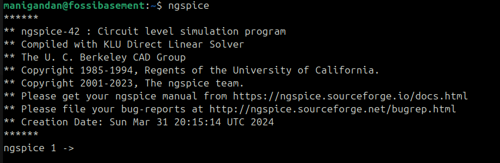
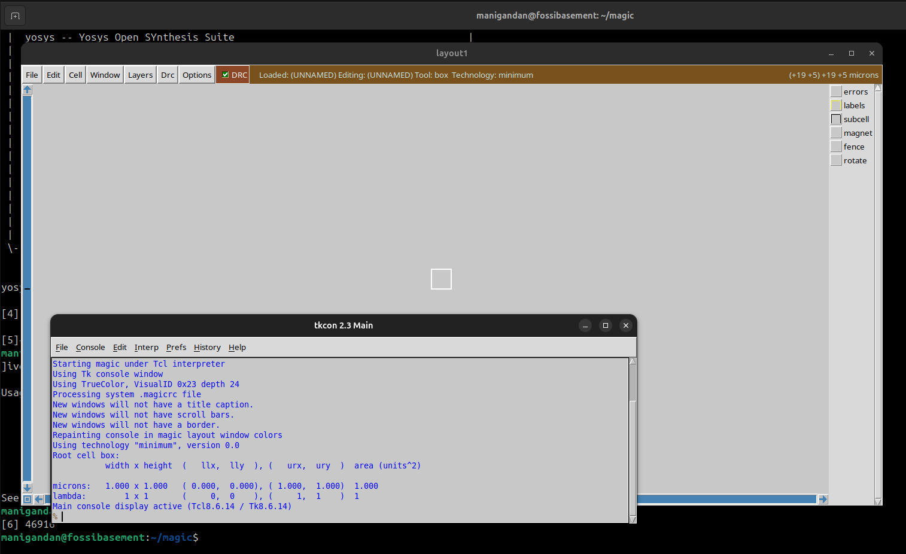

# Week 0 – Task 0

## Objective
- Create GitHub repo for documentation  
- Check system requirements  
- Install all required tools for the RISC-V SoC Tapeout flow.

## System Specs
- RAM     : 6 GB  
- Storage : 50 GB+  
- CPU     : 4 vCPUs  
- OS      : Ubuntu 20.04 

## Tools Installed
- **Yosys**
- **Icarus Verilog (iverilog)**
- **GTKWave**
- **Ngspice**
- **Magic**
- **OpenLANE** (with Docker)

## Installation Steps & Logs

### 1. Yosys
```bash
$ sudo apt-get update
$ git clone https://github.com/YosysHQ/yosys.git
$ cd yosys
$ sudo apt install make               # If make is not installed
$ sudo apt-get install build-essential clang bison flex \
    libreadline-dev gawk tcl-dev libffi-dev git \
    graphviz xdot pkg-config python3 libboost-system-dev \
    libboost-python-dev libboost-filesystem-dev zlib1g-dev
$ make config-gcc
# Yosys build depends on a Git submodule called abc, which hasn't been initialized yet. You need to run the following command before running make
$ git submodule update --init --recursive
$ make 
$ sudo make install
```


### 2. Icarus Verilog
```bash
$ sudo apt-get update
$ sudo apt-get install iverilog
```


### 3. GTKwave
```bash
$ sudo apt-get update
$ sudo apt install gtkwave
```


### 4. Ngspice
```bash
$ sudo apt update
$ sudo apt install ngspice
```


### 5. Magic VLSI
```bash
# Install required dependencies
sudo apt-get install m4
sudo apt-get install tcsh
sudo apt-get install csh
sudo apt-get install libx11-dev
sudo apt-get install tcl-dev tk-dev
sudo apt-get install libcairo2-dev
sudo apt-get install mesa-common-dev libglu1-mesa-dev
sudo apt-get install libncurses-dev

# Clone Magic repository
git clone https://github.com/RTimothyEdwards/magic
cd magic

# Configure build
./configure

# Build Magic
make

# Install system-wide
sudo make install
```

